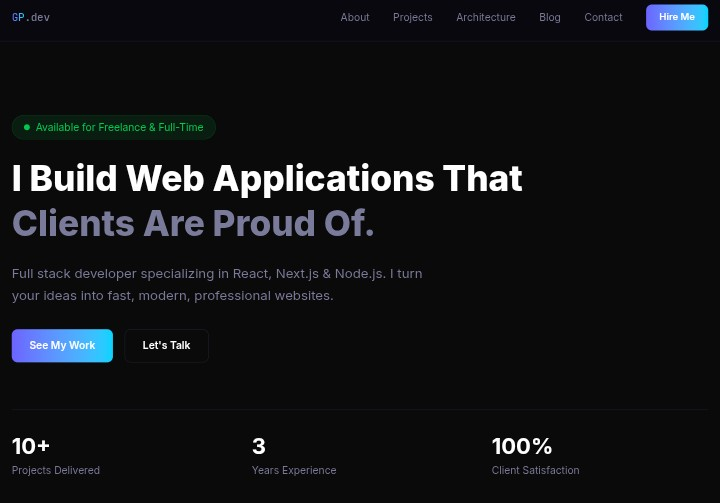

# Goodluck Prosper — Full-Stack Developer Portfolio

A modern, responsive portfolio and personal blog built to showcase my software engineering projects, technical skills, and what I'm learning and building.

**[🌐 View Live Portfolio →](https://goodluckprosper.vercel.app)**

---

## 📸 Preview



More screenshots are available in the [`screenshots/`](screenshots/) directory.

---

## 📖 About

This is my personal developer portfolio, built to showcase my work as a full-stack developer and document my journey of learning, building, and sharing technical ideas.

It combines a project showcase, technical blog, and personal information in one application. Rather than just listing projects, I use it to show how I approach software development — from frontend architecture and database design to authentication, deployment, performance, and SEO.

---

## ✨ Features

- 🎨 **Responsive Design** — Mobile-first interface that works across desktop, tablet, and mobile
- ⚡ **Performance Optimized** — Built with Next.js for optimized rendering and performance
- 🧩 **Project Showcase** — Selected projects with descriptions, technologies, and details
- ✍️ **Technical Blog** — Articles about software development, technology, and lessons learned
- 🔐 **Authentication** — Supabase authentication for protected functionality
- 🗄️ **PostgreSQL Database** — Supabase PostgreSQL for application data
- 📱 **Contact Integration** — Easy ways for visitors to connect
- 🔍 **SEO Optimized** — Metadata and SEO best practices for discoverability
- 🌙 **Dark Mode** — Light and dark theme support
- 📐 **Reusable Components** — Modular React components for maintainability

---

## 🛠️ Tech Stack

**Frontend**
- Next.js
- React
- TypeScript
- Tailwind CSS

**Backend & Data**
- Supabase (PostgreSQL, Authentication, backend services)

**Deployment**
- Vercel

**Development Tools**
- ESLint
- PostCSS
- Git / GitHub

---

## 🏗️ Architecture

```
                        USER
                         │
                         ▼
                    ┌───────────┐
                    │  Browser  │
                    └─────┬─────┘
                          │
                          ▼
                 ┌─────────────────┐
                 │     Next.js     │
                 │   React + TS    │
                 └────────┬────────┘
                          │
              ┌───────────┴───────────┐
              ▼                       ▼
       ┌─────────────┐         ┌─────────────┐
       │  Supabase   │         │    Blog     │
       │    Auth     │         │   Content   │
       └──────┬──────┘         └─────────────┘
              │
              ▼
       ┌─────────────┐
       │ PostgreSQL  │
       └─────────────┘
              │
              ▼
       ┌─────────────┐
       │   Vercel    │
       └─────────────┘
```

---

## 📁 Project Structure

```
my-portifolio/
│
├── public/                    # Static assets
│
├── src/
│   ├── app/                   # Next.js App Router
│   ├── components/            # Reusable React components
│   ├── styles/                # Global styles
│   └── ...
│
├── sql/                       # Database schemas and SQL files
│
├── screenshots/               # Project screenshots for documentation
│   ├── portfolio-preview.png
│   ├── projects.png
│   └── blog.png
│
├── package.json                # Dependencies and scripts
├── tsconfig.json               # TypeScript configuration
└── README.md                   # Project documentation
```

---

## 🚀 Getting Started

### Prerequisites

- Node.js 18+
- npm or yarn
- A [Supabase](https://supabase.com) project

### 1. Clone the repository

```bash
git clone https://github.com/Goodluck9191/my-portifolio.git
cd my-portifolio
```

### 2. Install dependencies

```bash
npm install
# or
yarn install
```

### 3. Configure environment variables

Create a `.env.local` file in the root directory:

```
NEXT_PUBLIC_SUPABASE_URL=your_supabase_project_url
NEXT_PUBLIC_SUPABASE_ANON_KEY=your_supabase_anon_key
```

You can find these values in your Supabase project dashboard under **Settings → API**.

> ⚠️ Never commit your `.env.local` file or expose private credentials in your repository.

### 4. Start the development server

```bash
npm run dev
# or
yarn dev
```

### 5. Open the application

Visit [http://localhost:3000](http://localhost:3000)

---

## 💻 Development

The application uses the Next.js App Router.

- Pages and routes: `src/app/`
- Reusable UI components: `src/components/`
- Global styling: `src/styles/`

Next.js automatically reloads the application during development when files are changed.

---

## 🗄️ Database

The project uses Supabase PostgreSQL for persistent data. Database-related SQL files are organized inside `sql/`.

Supabase also provides authentication and other backend services used by the application.

---

## 🔐 Admin Dashboard

The portfolio includes an admin area for managing website content. Authenticated administrators can manage content without directly modifying the source code.

### Admin Capabilities

The admin functionality allows authorized users to:

- ✍️ Create blog posts
- 📝 Edit existing blog posts
- 🗑️ Delete blog posts
- 🚀 Add new projects
- ✏️ Edit project information
- 🗑️ Delete projects
- 📊 Manage portfolio content

### Content Management Flow

```
                 ADMIN
                   │
                   ▼
            Admin Dashboard
                   │
          ┌────────┴────────┐
          ▼                 ▼
       Blog Posts        Projects
          │                 │
          └────────┬────────┘
                    ▼
                Supabase
                   │
                   ▼
               PostgreSQL
                   │
                   ▼
               Portfolio
                 Users
```

### Authentication

The admin area is protected using Supabase Authentication. Only authenticated users with the appropriate permissions can access administrative functionality.

### Why This Matters

The admin dashboard makes the portfolio easier to maintain because new projects and blog posts can be added through the application instead of manually changing the source code.

**Without Admin Dashboard:**
```
Write article → Modify code → Commit changes → Deploy → Article appears
```

**With Admin Dashboard:**
```
Write article → Admin Dashboard → Save → Supabase → Article appears
```

This turns the portfolio from a simple static website into a full-stack, content-driven application.

---

## 🧪 Production Build

```bash
npm run build
npm run start
```

---

## ☁️ Deployment

The portfolio is deployed on **Vercel**: [goodluckprosper.vercel.app](https://goodluckprosper.vercel.app)

The deployment is connected to this GitHub repository — pushes to `main` automatically trigger a new deployment.

**To deploy your own version:**
1. Fork or clone the repository
2. Create a Vercel project
3. Connect the GitHub repository
4. Configure the required environment variables
5. Deploy the application

---

## 📂 Featured Projects

The portfolio showcases projects across different areas of software development:

- **Full-Stack Applications** — End-to-end applications involving frontend interfaces, backend services, databases, authentication, and deployment
- **Web Applications** — Responsive web applications designed around real-world use cases and user experience
- **Creative Projects** — Web and design projects that combine software development with visual communication

**[View Projects →](https://goodluckprosper.vercel.app/projects)**

---

## ✍️ Blog

The portfolio includes a technical blog where I write about:

- Software engineering
- Web development
- Artificial intelligence
- System design
- Lessons learned while building projects

The goal isn't only to build software, but to understand, document, and share what I learn.

**[Read the Blog →](https://goodluckprosper.vercel.app/blog)**

---

## 🔐 Security

Environment variables containing credentials or project-specific secrets should never be committed to the repository. `.env.local` should remain local and stay in `.gitignore`:

```
.env.local
.env
```

Only public configuration values that are safe for client-side use should use the `NEXT_PUBLIC_` prefix.

---

## 📈 Future Improvements

- [ ] Improved project case studies
- [ ] More detailed technical documentation
- [ ] Improved blog experience
- [ ] Advanced search and filtering
- [ ] Improved accessibility
- [ ] Performance optimization
- [ ] Analytics integration
- [ ] Additional interactive features
- [ ] More detailed project architecture diagrams

---

## 🤝 Feedback

Suggestions, ideas, and feedback are welcome. If you find an issue or have an idea for improving the project, feel free to open an issue or connect with me on LinkedIn.

---

## 📬 Contact & Connect

- 🌐 Portfolio: [goodluckprosper.vercel.app](https://goodluckprosper.vercel.app)
- 💼 LinkedIn: [linkedin.com/in/goodluckprosper](https://www.linkedin.com/in/goodluck-prosper-1a31303b3)
- 💻 GitHub: [@Goodluck9191](https://github.com/Goodluck9191)

---

## 👨‍💻 Author

**Goodluck Prosper**
Full-Stack Developer focused on building modern, scalable, and user-friendly web applications.

---

## 📄 License

Unless otherwise stated, the code in this repository is provided for learning and portfolio purposes. Please contact me before reusing substantial portions of the project in another application.

---

**Last Updated:** August 2026
